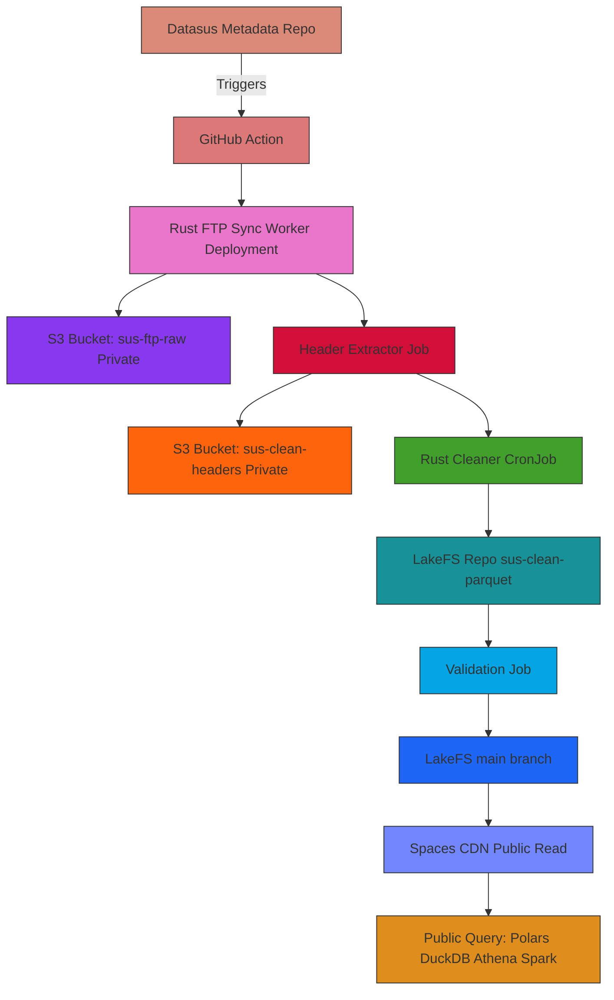

# SUS Mirror

## 🎯 arrow-sus: Full SUS FTP → Data Lake Pipeline

______________________________________________________________________

### ✅ **What you’re building**

A robust, secure, reproducible pipeline to:

1. 📥 Mirror Brazil’s SUS FTP data to your own S3 (DigitalOcean Spaces).
1. 🧹 Extract `.dbc` headers to generate exact PHF-based schemas.
1. 🦀 Clean and normalize the raw data with Rust.
1. 🗂️ Write high-quality Parquet to a LakeFS versioned repo.
1. 🔒 Keep raw & intermediate buckets private.
1. 🚀 Expose only the final `main` branch as public, edge-cached Parquet via a CDN.
1. 🧩 Query easily with Polars, DuckDB, Athena, Spark, or any Arrow-native tool.

______________________________________________________________________

### ⚙️ **How it’s structured**

| Layer                    | Tool/Service                    | Access                   |
| ------------------------ | ------------------------------- | ------------------------ |
| Raw mirror bucket        | DO Spaces (`sus-ftp-raw`)       | Private                  |
| Header extraction bucket | DO Spaces (`sus-clean-headers`) | Private                  |
| Clean Parquet bucket     | DO Spaces (`sus-clean-parquet`) | Public-read w/ CDN       |
| Versioning + branches    | LakeFS + DO Spaces              | `staging` → `main` → CDN |
| Compute + Orchestration  | Rust workers + K8s CronJobs     | Cluster-private          |
| Public delivery          | DO Spaces CDN                   | Public, global edge      |

______________________________________________________________________

### 🚀 **End-to-end flow**

1️⃣ `datasus-metadata` triggers a GitHub Action.\
2️⃣ Rust FTP sync worker runs in K8s → pulls `.dbc` files → uploads to `sus-ftp-raw`.\
3️⃣ Header extractor job parses `.dbc` → saves schema blobs to `sus-clean-headers`.\
4️⃣ Cleaner job validates + normalizes → writes Parquet to `sus-clean-parquet` via LakeFS `staging` branch.\
5️⃣ After validation, `lakectl merge staging main` promotes trusted data to `main`.\
6️⃣ The `main` branch is edge-cached by DigitalOcean’s CDN — versioned, fast, global.\
7️⃣ Public readers can query instantly via Polars, DuckDB, or any Arrow tool.

______________________________________________________________________

### ✅ **Key guarantees**

- 📌 Raw and intermediate data stays private.
- 📌 Only validated Parquet is public.
- 📌 Every update is versioned, branchable, and reproducible.
- ⚡ Fast reads for researchers, partners, or public dashboards.

______________________________________________________________________

### 📚 **Example query**

```python
import polars as pl

df = pl.read_parquet("https://YOUR-CDN-URL/main/.../file.parquet")
```

______________________________________________________________________

🎉 **arrow-sus: Clean, versioned SUS data, built the right way.**

## 🗺️ arrow-sus: End-to-End Architecture Diagram (Fixed)



______________________________________________________________________

## Step 1 — Bootstrap the Rust project for the SUS FTP → S3 mirror

1️⃣ **Create the Rust workspace**

```bash
cargo new --bin sus-mirror
cd sus-mirror
```

2️⃣ **Add dependencies to `Cargo.toml`**

```toml
[dependencies]
tokio = { version = "1", features = ["full"] }   # Async runtime
suppaftp = { version = "5.1", features = ["secure-rustls"] } # Modern FTP(S) client
aws-sdk-s3 = "1.17"                              # S3 upload
log = "0.4"
env_logger = "0.11"
serde = { version = "1.0", features = ["derive"] }
serde_json = "1.0"
reqwest = { version = "0.12", features = ["json", "stream"] } # Optional for HTTP fallback
phf = "0.11"
phf_codegen = "0.11"
anyhow = "1.0"
```

3️⃣ **Initialize Git**

```bash
git init
```

## ✅ Step 2 — Use pure Rust `AsyncRustlsConnector` for secure FTPS

______________________________________________________________________

📚 Reference: [AsyncRustlsConnector](https://docs.rs/suppaftp/latest/suppaftp/struct.AsyncRustlsConnector.html)

______________________________________________________________________

### ✅ Dependencies

```toml
[dependencies]
suppaftp = { version = "5.1", features = ["async-rustls"] }
tokio = { version = "1", features = ["full"] }
anyhow = "1.0"
log = "0.4"
env_logger = "0.11"
```

______________________________________________________________________

### ✅ Example `src/main.rs` (pure Rust TLS)

```rust
use suppaftp::{AsyncFtpStream, AsyncRustlsConnector};
use anyhow::Result;

#[tokio::main]
async fn main() -> Result<()> {
    env_logger::init();

    let server = "ftp.datasus.gov.br:21";
    let hostname = "ftp.datasus.gov.br";

    // 1️⃣ Connect to FTP server
    let ftp_stream = AsyncFtpStream::connect(server).await?;
    println!("Connected to {server}");

    // 2️⃣ Upgrade to secure FTPS using pure rustls
    let rustls_connector = AsyncRustlsConnector::new();
    let mut ftp_stream = ftp_stream.into_secure(rustls_connector, hostname).await?;
    println!("Connection upgraded to secure FTPS (rustls)");

    // 3️⃣ Log in anonymously
    ftp_stream.login("anonymous", "anonymous").await?;
    println!("Logged in as anonymous");

    // 4️⃣ List files
    ftp_stream.cwd("/dissemin/publicos/SIHSUS/200801_/Dados/").await?;
    let files = ftp_stream.nlst(None).await?;
    println!("Files: {:?}", files);

    // 5️⃣ Quit
    ftp_stream.quit().await?;
    println!("Connection closed");

    Ok(())
}
```

______________________________________________________________________

## ✅ Why this is better

- Uses `AsyncRustlsConnector` → no OpenSSL or native TLS needed.
- One less dependency (`async-native-tls` not required).
- Containers get smaller & more portable.

______________________________________________________________________

### ✅ Notes

- Uses **async FTPS** with `rustls` for secure encrypted FTP.
- Uses `tokio` for async I/O.
- Adjust the `cwd` path to whichever module/year you want to test.
- Logs show each stage so you can confirm your connection is secure.

______________________________________________________________________

✅ This updates your **STEP 2** to be modern, safe, and idiomatic Rust FTPS — exactly like the official suppaftp example!

______________________________________________________________________

## Step 3 — Set up your DigitalOcean Spaces buckets for secure raw + clean storage

______________________________________________________________________

### ✅ 1️⃣ Create three Spaces buckets

In your [DigitalOcean dashboard](https://cloud.digitalocean.com/spaces):

- `sus-ftp-raw` → 📦 holds raw `.dbc` files directly from the SUS FTP. **Private.**
- `sus-clean-headers` → 🗂️ holds extracted header blobs for PHF codegen. **Private.**
- `sus-clean-parquet` → ✅ holds cleaned, validated Parquet output. **Public read-only.**

______________________________________________________________________

### ✅ 2️⃣ Generate one Spaces API key

- Go to **API → Tokens/Keys → Spaces access keys**.
- Click **Generate New Key**.
- Save your **Access Key** and **Secret Key** safely.

______________________________________________________________________

### ✅ 3️⃣ Store your credentials locally

In your `~/.aws/credentials` or `.env`:

```ini
[default]
aws_access_key_id = YOUR_SPACES_ACCESS_KEY
aws_secret_access_key = YOUR_SPACES_SECRET_KEY
region = us-east-1
```

💡 DigitalOcean Spaces is always `us-east-1` for config, but uses a custom endpoint like `nyc3.digitaloceanspaces.com`.

______________________________________________________________________

### ✅ 4️⃣ Confirm your buckets exist

Test with the `aws` CLI:

```bash
aws s3 ls --endpoint-url https://nyc3.digitaloceanspaces.com
```

______________________________________________________________________

### ✅ 5️⃣ Apply public-read policy to the `sus-clean-parquet` bucket

In the DigitalOcean Spaces dashboard:

- Open your `sus-clean-parquet` bucket.
- Go to **Settings → Permissions → Bucket Policy**.
- Paste this JSON:

```json
{
  "Version": "2012-10-17",
  "Statement": [
    {
      "Sid": "PublicReadGetObject",
      "Effect": "Allow",
      "Principal": "*",
      "Action": [
        "s3:GetObject"
      ],
      "Resource": [
        "arn:aws:s3:::sus-clean-parquet/*"
      ]
    }
  ]
}
```

✅ This means:

- Anyone can `GET` Parquet files.
- No one can overwrite/delete them.
- Your internal jobs write to it — your cluster controls what’s published.

______________________________________________________________________

### ✅ 6️⃣ (Optional) Example LakeFS repo layout

If you run LakeFS on top:

- `lakefs-repo` → points to the same `sus-clean-parquet` bucket (or an internal one).
- `branch: staging` → for your in-progress ETL.
- `branch: public` → final commits merged here, made available to the world.

______________________________________________________________________

### ✅ 7️⃣ Next up: Your Rust `aws-sdk-s3` config (Step 4) just needs to choose the right bucket per worker

| Worker           | Bucket name         |
| ---------------- | ------------------- |
| FTP sync worker  | `sus-ftp-raw`       |
| Header extractor | `sus-clean-headers` |
| Rust cleaner     | `sus-clean-parquet` |

Use env vars to pass the `BUCKET_NAME` into your containers.

______________________________________________________________________

✅ Done — you now have a secure private-to-public Spaces design, ready to mirror, clean, and expose only trusted Parquet output!

## Step 4 — Update your Rust `aws-sdk-s3` client to handle multiple buckets

______________________________________________________________________

### ✅ 1️⃣ Pass the bucket name dynamically

Each Deployment / CronJob should set the right `BUCKET_NAME` for its role:

- `sus-ftp-raw` for raw `.dbc` files.
- `sus-clean-headers` for extracted header blobs.
- `sus-clean-parquet` for final cleaned Parquet (public).

______________________________________________________________________

### ✅ 2️⃣ Example Rust config (with Spaces endpoint)

```rust
use aws_sdk_s3::{Client, Endpoint, Region, Config};
use aws_config::meta::region::RegionProviderChain;
use aws_smithy_http::endpoint::Endpoint as SmithyEndpoint;
use std::str::FromStr;
use anyhow::Result;

pub async fn build_spaces_client() -> Result<Client> {
    let region_provider = RegionProviderChain::default_provider().or_else("us-east-1");

    let custom_endpoint = SmithyEndpoint::immutable(
        http::Uri::from_str("https://nyc3.digitaloceanspaces.com")?
    );

    let config = Config::builder()
        .region(Region::new("us-east-1"))
        .endpoint_resolver(custom_endpoint)
        .credentials_provider(
            aws_config::from_env()
                .region(region_provider)
                .load()
                .await
                .credentials()
                .await?
        )
        .build();

    Ok(Client::from_conf(config))
}
```

______________________________________________________________________

### ✅ 3️⃣ Example upload

```rust
use aws_sdk_s3::types::ByteStream;

pub async fn upload_object(
    client: &Client,
    bucket: &str,
    key: &str,
    body: Vec<u8>
) -> Result<()> {
    client.put_object()
        .bucket(bucket)
        .key(key)
        .body(ByteStream::from(body))
        .send()
        .await?;
    Ok(())
}
```

______________________________________________________________________

### ✅ 4️⃣ Pass `BUCKET_NAME` in your Kubernetes YAML

Example:

```yaml
env:
  - name: BUCKET_NAME
    value: "sus-ftp-raw"
```

Your Rust worker can read it:

```rust
let bucket_name = std::env::var("BUCKET_NAME").expect("BUCKET_NAME must be set");
```

______________________________________________________________________

✅ Done — your Rust sync, header extractor, and cleaner now route to the correct Spaces bucket!

## Step 5 — Finalize your Kubernetes Deployments & CronJobs for the multi-bucket pipeline

______________________________________________________________________

### ✅ 1️⃣ Make sure each workload uses the right bucket

| Component        | BUCKET_NAME value   |
| ---------------- | ------------------- |
| FTP sync worker  | `sus-ftp-raw`       |
| Header extractor | `sus-clean-headers` |
| Rust cleaner     | `sus-clean-parquet` |

______________________________________________________________________

### ✅ 2️⃣ Example Deployment (FTP sync worker)

```yaml
apiVersion: apps/v1
kind: Deployment
metadata:
  name: sus-ftp-sync
  namespace: sus-mirror
spec:
  replicas: 2
  selector:
    matchLabels:
      app: sus-ftp-sync
  template:
    metadata:
      labels:
        app: sus-ftp-sync
    spec:
      containers:
      - name: sus-ftp-sync
        image: ghcr.io/YOUR_GITHUB_USERNAME/sus-ftp-sync:latest
        env:
          - name: AWS_ACCESS_KEY_ID
            valueFrom:
              secretKeyRef:
                name: spaces-credentials
                key: AWS_ACCESS_KEY_ID
          - name: AWS_SECRET_ACCESS_KEY
            valueFrom:
              secretKeyRef:
                name: spaces-credentials
                key: AWS_SECRET_ACCESS_KEY
          - name: SPACES_ENDPOINT
            value: "https://nyc3.digitaloceanspaces.com"
          - name: BUCKET_NAME
            value: "sus-ftp-raw"
```

______________________________________________________________________

### ✅ 3️⃣ Example CronJob (Cleaner)

```yaml
apiVersion: batch/v1
kind: CronJob
metadata:
  name: sus-cleaner-cron
  namespace: sus-mirror
spec:
  schedule: "0 * * * *"
  jobTemplate:
    spec:
      template:
        spec:
          containers:
          - name: sus-cleaner
            image: ghcr.io/YOUR_GITHUB_USERNAME/sus-cleaner:latest
            env:
              - name: AWS_ACCESS_KEY_ID
                valueFrom:
                  secretKeyRef:
                    name: spaces-credentials
                    key: AWS_ACCESS_KEY_ID
              - name: AWS_SECRET_ACCESS_KEY
                valueFrom:
                  secretKeyRef:
                    name: spaces-credentials
                    key: AWS_SECRET_ACCESS_KEY
              - name: SPACES_ENDPOINT
                value: "https://nyc3.digitaloceanspaces.com"
              - name: BUCKET_NAME
                value: "sus-clean-parquet"
          restartPolicy: OnFailure
```

______________________________________________________________________

### ✅ 4️⃣ Store your Secrets once

```bash
kubectl create secret generic spaces-credentials \
  --namespace=sus-mirror \
  --from-literal=AWS_ACCESS_KEY_ID=YOUR_ACCESS_KEY \
  --from-literal=AWS_SECRET_ACCESS_KEY=YOUR_SECRET_KEY
```

______________________________________________________________________

### ✅ 5️⃣ Check it works

```bash
kubectl get pods -n sus-mirror
kubectl logs -f deployment/sus-ftp-sync -n sus-mirror
kubectl get cronjobs -n sus-mirror
```

______________________________________________________________________

✅ You now have your secure mirror → cleaner → public Parquet setup, all with the right buckets and policies!

## Step 6 — Use LakeFS to version your cleaned Parquet output

______________________________________________________________________

### 📦 **Why use LakeFS here?**

- 🧬 You get git-like branches for your data.
- ✅ You keep raw + intermediate files private, but version your final Parquet before making it public.
- 🚀 You can test a new clean job in a `staging` branch, then `merge` to `main` for production/public.

______________________________________________________________________

### ✅ 1️⃣ Install LakeFS in the same cluster

**Option A:** Use Helm

```bash
helm repo add lakefs https://charts.lakefs.io
helm repo update

helm upgrade --install lakefs lakefs/lakefs \
  --namespace lakefs \
  --create-namespace \
  --set externalS3.accessKey=YOUR_SPACES_ACCESS_KEY \
  --set externalS3.secretKey=YOUR_SPACES_SECRET_KEY \
  --set externalS3.region=us-east-1 \
  --set externalS3.endpoint=https://nyc3.digitaloceanspaces.com \
  --set lakefsConfig.database.type=local \
  --set ingress.enabled=true \
  --set ingress.host=YOUR_LAKEFS_DOMAIN
```

______________________________________________________________________

### ✅ 2️⃣ Create your LakeFS repository

In the LakeFS web UI or `lakectl`:

```bash
lakectl repo create \
  lakefs-repo \
  s3://sus-clean-parquet
```

✅ This means LakeFS points to your **public Parquet bucket**, but controls writes via its branching system.

______________________________________________________________________

### ✅ 3️⃣ Use branches to manage what’s published

Example branch structure:

| Branch    | Purpose                                        |
| --------- | ---------------------------------------------- |
| `main`    | Your trusted, clean, public data               |
| `staging` | Where you write new Parquet from cleaning jobs |
| `dev`     | Experimental work if needed                    |

Your `rust-cleaner` job:

- Writes to `staging` branch.
- Once validated, you `merge` staging → main.
- The `main` branch is what you expose publicly.

______________________________________________________________________

### ✅ 4️⃣ Example cleaner output config

Your `rust-cleaner` should:

- Use `lakefs` auth to write to `s3://sus-clean-parquet/staging/...`
- Or use LakeFS’s S3 gateway endpoint if you want it to enforce branch isolation.

______________________________________________________________________

### ✅ 5️⃣ Automate merge after validation

Add a simple script or CI step:

```bash
lakectl merge staging main
```

______________________________________________________________________

✅ Now you have:

- Raw files → private
- Headers → private
- Cleaned Parquet → versioned with LakeFS
- `main` branch published to your public bucket for the world to read

______________________________________________________________________

### ✅ 6️⃣ More ideas

- Use LakeFS hooks to validate schema before merge.
- Keep a `logs/` folder in the repo with cleaning run summaries.
- Use `lakectl diff` to see what changed between commits.

______________________________________________________________________

📌 **Next:** We can sketch **STEP 7**, your final public access setup and shareable read-only URL for anyone who wants your clean Parquet!

## Step 8 — Example: Query your public Parquet via the CDN (Polars & DuckDB)

______________________________________________________________________

### ✅ 1️⃣ Confirm your final CDN link

After your LakeFS merge → `main` → `sus-clean-parquet` → DO CDN:

Example CDN link:

```text
https://sus-clean-parquet.nyc3.cdn.digitaloceanspaces.com/main/SIH/2023/RD2301.parquet
```

______________________________________________________________________

### ✅ 2️⃣ Example Polars usage

```python
import polars as pl

# 📌 Use your actual CDN URL!
url = "https://sus-clean-parquet.nyc3.cdn.digitaloceanspaces.com/main/SIH/2023/RD2301.parquet"

df = pl.read_parquet(url)

print(df.head())
```

✅ Polars streams the Parquet directly over HTTP — no local download needed!

______________________________________________________________________

### ✅ 3️⃣ Example DuckDB usage

```sql
-- 📌 In a DuckDB SQL shell
INSTALL httpfs;
LOAD httpfs;

-- Query directly over HTTP
SELECT *
FROM read_parquet('https://sus-clean-parquet.nyc3.cdn.digitaloceanspaces.com/main/SIH/2023/RD2301.parquet')
LIMIT 10;
```

Or, in Python:

```python
import duckdb

url = "https://sus-clean-parquet.nyc3.cdn.digitaloceanspaces.com/main/SIH/2023/RD2301.parquet"

con = duckdb.connect()
con.execute("INSTALL httpfs; LOAD httpfs;")

df = con.execute(f"""
    SELECT * FROM read_parquet('{url}') LIMIT 10
""").df()

print(df.head())
```

✅ DuckDB fetches from the CDN, works locally or in the cloud.

______________________________________________________________________

### ✅ 4️⃣ Why this rocks

✔️ Users get edge-cached, fast reads.\
✔️ Your raw and intermediate data stays private.\
✔️ If you roll back a LakeFS commit, old files disappear instantly.\
✔️ Your public index (`manifest.json`) always points to valid, versioned Parquet.

______________________________________________________________________

🎉 That’s it — your full `arrow-sus` pipeline:

- Raw `.dbc` → private.
- Clean Parquet → versioned with LakeFS.
- Final branch → edge-cached CDN → ready for Polars, DuckDB, Athena, or Spark.

🚀 **Ready for the world!**
