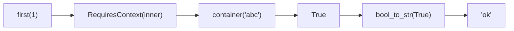

# Context

Dependency injection is a popular software architecture pattern.

Its main idea is that you provide [Inversion of Control](https://en.wikipedia.org/wiki/Inversion_of_control) and can pass different things into your logic instead of hardcoding your stuff. By doing this you are on your way to achieve [Single Responsibility](https://en.wikipedia.org/wiki/Single_responsibility_principle) for your functions and objects.

## Using the context

A lot of programs we write rely on the context implicitly or explicitly. We can rely on configuration, env variables, stubs, logical dependencies, etc.

Let's look at the example.

### Simple app

One of the most popular errors Python developers do in `Django` is that they overuse `settings` object inside the business logic. This makes your logic framework-oriented and hard to reason about in large projects.

Because values just pop out of nowhere in deeply nested functions. And can be changed from the outside, from the context of your app.

Imagine that you have a `django` based game, where you award users with points for each guessed letter in a word (unguessed letters are marked as `'.'`):

```python
from django.http import HttpRequest, HttpResponse
from words_app.logic import calculate_points


def view(request: HttpRequest) -> HttpResponse:
    user_word: str = request.POST["word"]  # just an example
    points = calculate_points(user_word)
    ...  # later you show the result to user somehow
```

```python
# Somewhere in your `words_app/logic.py`:


def calculate_points(word: str) -> int:
    guessed_letters_count = len([letter for letter in word if letter != "."])
    return _award_points_for_letters(guessed_letters_count)


def _award_points_for_letters(guessed: int) -> int:
    return 0 if guessed < 5 else guessed  # minimum 6 points possible!
```

Straight and simple!

## Section 2: Adding Configuration

````markdown:returns/returns_context.md
### Adding configuration

But, later you decide to make the game more fun: let's make the minimal accountable letters threshold configurable for an extra challenge.

You can just do it directly:

```python
def _award_points_for_letters(guessed: int, threshold: int) -> int:
    return 0 if guessed < threshold else guessed
````

And now your code won't simply type-check. Because that's how our caller looks like:

```python
def calculate_points(word: str) -> int:
    guessed_letters_count = len([letter for letter in word if letter != "."])
    return _award_points_for_letters(guessed_letters_count)
```

To fix this `calculate_points` function (and all other upper caller functions) will have to accept `threshold: int` as a parameter and pass it to `_award_points_for_letters`.

Imagine that your large project has multiple things to configure in multiple functions. What a mess it would be!

Ok, you can directly use `django.settings` (or similar) in your `_award_points_for_letters` function. And ruin your pure logic with framework-specific details. That's ugly!

### Explicitly relying on context

We have learned that this tiny change showed us that it is not so easy to rely on implicit app context.

And instead of passing parameters for all callstack or using dirty framework specific magic you can use `RequiresContext` container. That was built just for this case.

Let's see how our code changes:

```python
from django.conf import settings
from django.http import HttpRequest, HttpResponse
from words_app.logic import calculate_points


def view(request: HttpRequest) -> HttpResponse:
    user_word: str = request.POST["word"]  # just an example
    points = calculate_points(user_words)(settings)  # passing the dependencies
    ...  # later you show the result to user somehow
```

```python
# Somewhere in your `words_app/logic.py`:

from typing import Protocol
from returns.context import RequiresContext


class _Deps(Protocol):  # we rely on abstractions, not direct values or types
    WORD_THRESHOLD: int


def calculate_points(word: str) -> RequiresContext[int, _Deps]:
    guessed_letters_count = len([letter for letter in word if letter != "."])
    return _award_points_for_letters(guessed_letters_count)


def _award_points_for_letters(guessed: int) -> RequiresContext[int, _Deps]:
    return RequiresContext(
        lambda deps: 0 if guessed < deps.WORD_THRESHOLD else guessed,
    )
```

And now you can pass your dependencies in a really direct and explicit way.

## Section 3: Ask Method

### ask

Let's try to configure how we mark our unguessed letters (previously unguessed letters were marked as `'.'`). Let's say, we want to change this to be `_`.

How can we do that with our existing function?

```python
def calculate_points(word: str) -> RequiresContext[int, _Deps]:
    guessed_letters_count = len([letter for letter in word if letter != "."])
    return _award_points_for_letters(guessed_letters_count)
```

We are already using `RequiresContext`, but its dependencies are just hidden from us! We have a special helper for this case: `.ask()`, which returns us current dependencies.

The only thing we need to is to properly annotate the type for our case: `RequiresContext[int, _Deps].ask()` Sadly, currently `mypy` is not able to infer the dependency type out of the context and we need to explicitly provide it.

Let's see the final result:

```python
from returns.context import RequiresContext


class _Deps(Protocol):  # we rely on abstractions, not direct values or types
    WORD_THRESHOLD: int
    UNGUESSED_CHAR: str


def calculate_points(word: str) -> RequiresContext[int, _Deps]:
    def factory(deps: _Deps) -> RequiresContext[int, _Deps]:
        guessed_letters_count = len(
            [letter for letter in word if letter != deps.UNGUESSED_CHAR]
        )
        return _award_points_for_letters(guessed_letters_count)

    return RequiresContext[int, _Deps].ask().bind(factory)
```

And now we access the current context from any place in our callstack. Isn't it convenient?

> **Warning:** `RequiresContext` and similar types are not recursion safe. If you would have nesting of more than `sys.getrecursionlimit()` you will end up with `RecursionError`. Will this ever happen to you? Probably not.

## RequiresContext container

The concept behind `RequiresContext` container is really simple. It is a container around `Callable[[EnvType], ReturnType]` function.

By its definition it works with pure functions that never fails.

It can be illustrated as a simple nested function:

```python
>>> from typing import Callable
>>> def first(limit: int) -> Callable[[str], bool]:
...     def inner(deps: str) -> bool:
...         return len(deps) > limit
...     return inner

>>> assert first(2)('abc')  # first(limit)(deps)
>>> assert not first(5)('abc')  # first(limit)(deps)
```

That's basically enough to make dependency injection possible. But how would you compose `first` function? Let's say with the following function:

```python
>>> def bool_to_str(arg: bool) -> str:
...     return 'ok' if arg else 'nope'
```

It would be hard, knowing that it returns another function to be called later when the context is known.

We can wrap it in `RequiresContext` container to allow better composition!

```python
>>> from returns.context import RequiresContext

>>> def first(limit: int) -> RequiresContext[bool, str]:
...     def inner(deps: str) -> bool:
...         return len(deps) > limit
...     return RequiresContext(inner)  # wrapping function here!

>>> assert first(1).map(bool_to_str)('abc') == 'ok'
>>> assert first(5).map(bool_to_str)('abc') == 'nope'
```

There's how execution flows:



The rule is: the dependencies are injected at the very last moment in time. And then normal logical execution happens.

## Section 5: RequiresContextResult Container

````markdown:returns/returns_context.md
## RequiresContextResult container

`RequiresContextResult` container is a combination of `RequiresContext[Result[a, b], env]`. Which means that it is a wrapper around pure function that might fail.

We also added a lot of useful methods for this container, so you can work easily with it:

- `bind_result` allows to bind functions that return `Result` with just one call
- `bind_context` allows to bind functions that return `RequiresContext` easily
- There are also several useful constructors from any possible type

Use it when you work with pure context-related functions that might fail.

## RequiresContextIOResult container

`RequiresContextIOResult` container is a combination of `RequiresContext[IOResult[a, b], env]`. Which means that it is a wrapper around impure function that might fail.

We also added a lot of useful methods for this container, so you can work easily with it:

- `bind_result` allows to bind functions that return `Result` with just one call
- `bind_io` allows to bind functions that return `IO` with just one call
- `bind_ioresult` allows to bind functions that return `IOResult` with just one call
- `bind_context` allows to bind functions that return `RequiresContext` easily
- There are also several useful constructors from any possible type

Use it when you work with impure context-related functions that might fail. This is basically **the main type** that is going to be used in most apps.

## RequiresContextFutureResult container

`RequiresContextFutureResult` container is a combination of `RequiresContext[FutureResult[a, b], env]`. Which means that it is a wrapper around impure async function that might fail.

Here's how it should be used:

```python
# Example from tests/test_examples/test_context/test_reader_future_result.py
````

This example illustrates the whole point of our actions: writing sync code that executes asynchronously without any magic at all!

We also added a lot of useful methods for this container, so you can work easily with it.

These methods are identical with `RequiresContextIOResult`:

- `bind_result` allows to bind functions that return `Result` with just one call
- `bind_io` allows to bind functions that return `IO` with just one call
- `bind_ioresult` allows to bind functions that return `IOResult` with just one call
- `bind_context` allows to bind functions that return `RequiresContext` easily

There are new ones:

- `bind_future` allows to bind functions that return `Future` container
- `bind_future_result` allows to bind functions that return `FutureResult` container
- `bind_async_future` allows to bind async functions that return `Future` container
- `bind_async_future_result` allows to bind async functions that return `FutureResult` container
- `bind_context_ioresult` allows to bind functions that return `RequiresContextIOResult`
- `bind_async` allows to bind async functions that return `RequiresContextFutureResult` container
- `bind_awaitable` allows to bind async function that return raw values

Use it when you work with impure context-related functions that might fail. This is basically **the main type** that is going to be used in most apps.

## Section 6: Aliases

## Aliases

There are several useful aliases for `RequiresContext` and friends with some common values:

- `Reader` is an alias for `RequiresContext[...]` to save you some typing. Uses `Reader` because it is a native name for this concept from Haskell.

- `RequiresContextResultE` is an alias for `RequiresContextResult[..., Exception]`, just use it when you want to work with `RequiresContextResult` containers that use exceptions as error type. It is named `ResultE` because it is `ResultException` and `ResultError` at the same time.

- `ReaderResult` is an alias for `RequiresContextResult[...]` to save you some typing.

- `ReaderResultE` is an alias for `RequiresContextResult[..., Exception]`

- `RequiresContextIOResultE` is an alias for `RequiresContextIOResult[..., Exception]`

- `ReaderIOResult` is an alias for `RequiresContextIOResult[...]` to save you some typing.

- `ReaderIOResultE` is an alias for `RequiresContextIOResult[..., Exception]`

- `RequiresContextFutureResultE` is an alias for `RequiresContextFutureResult[..., Exception]`

- `ReaderFutureResult` is an alias for `RequiresContextFutureResult[...]` to save you some typing.

- `ReaderFutureResultE` is an alias for `RequiresContextFutureResult[..., Exception]`
